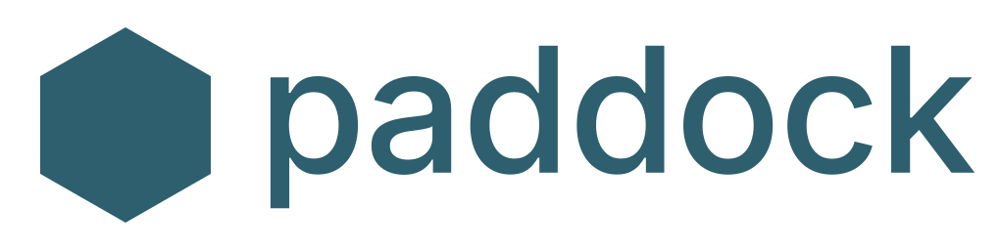

<p align="center">
  <picture>
    <source media="(prefers-color-scheme: dark)" srcset="assets/paddock-lockup-dark.svg">
    
  </picture>
</p>

> Run AI agent harnesses as first-class Kubernetes workloads, with the safety rails built in.

Paddock is an open-source, Kubernetes-native platform for running headless AI agent harnesses — Claude Code, Codex CLI, OpenCode, Pi, or anything else you can put in a container — as templated, sandboxed, observable batch workloads. v0.3 adds a capability-scoped **broker** for credential issuance and a per-run **egress proxy** that MITMs TLS so the agent never sees upstream API keys.

> **Status:** pre-1.0. Expect breaking changes between minor versions until v1.0; pin to a tagged release for stability.

**Start at [`docs/`](docs/)** — audience-routed entry point for evaluators, operators, harness authors, security reviewers, and contributors.

For deeper internal reading: [`VISION.md`](VISION.md) (product north star), [`docs/internal/specs/`](docs/internal/specs/) (implementation specs), [`docs/contributing/adr/`](docs/contributing/adr/) (architecture decisions).

## What's in the box

Paddock is built around five CRDs (`HarnessTemplate` / `ClusterHarnessTemplate`, `HarnessRun`, `Workspace`, `BrokerPolicy`, `AuditEvent`), a control plane (controller + admission webhooks + capability-scoped broker), and per-run sidecars (egress proxy + adapter + collector + a transparent-mode iptables-init). See [`docs/concepts/components.md`](docs/concepts/components.md) for the full inventory.

Reference harnesses: `paddock-echo` (deterministic CI fixture) and Claude Code (real-agent demo).

## Quickstart

A complete kind-cluster walkthrough — local cluster, both reference harnesses (`paddock-echo` and Claude Code), `BrokerPolicy` setup, and the observability surface — lives in [`docs/getting-started/quickstart.md`](docs/getting-started/quickstart.md). Runs end-to-end in about ten minutes.

Prerequisites: Go 1.26+, Docker, `kubectl`, [Kind](https://kind.sigs.k8s.io/) 0.25+, Kubernetes 1.29+ on the target cluster.

## Installing a published release

CI publishes versioned images and the Helm chart to GitHub Container Registry (ghcr.io) as OCI artifacts on every tagged release. Every push to `main` also publishes bleeding-edge images under the `:main` tag (with immutable `:main-<sha>` for pinning).

```sh
helm install paddock \
  oci://ghcr.io/tjorri/charts/paddock \
  --version 0.3.0 \
  --namespace paddock-system --create-namespace
```

Or install a specific tagged release via the single-file manifest:

```sh
kubectl apply --server-side=true --force-conflicts \
  -f https://github.com/tjorri/paddock/releases/download/v0.3.0/install.yaml
```

Every image is Cosign-signed (keyless, Sigstore). Verification is optional:

```sh
cosign verify ghcr.io/tjorri/paddock-manager:v0.3.0 \
  --certificate-identity-regexp='^https://github\.com/tjorri/paddock/' \
  --certificate-oidc-issuer='https://token.actions.githubusercontent.com'
```

Pin to a specific main-branch commit via `:main-<sha>` (first seven chars of the commit SHA).

## Concepts in 90 seconds

```
ClusterHarnessTemplate   image + command + eventAdapter + requires (cred + egress)
        ▲
        │ baseTemplateRef (inherits locked fields)
HarnessTemplate          namespaced; can override defaults + requires
        ▲
        │ templateRef
HarnessRun               one invocation: prompt + workspace + model
        │
        ├── BrokerPolicy (in-namespace)  grants → admission intersects with requires
        ├── Workspace                    seeded PVC, serialised to one active run
        ├── AuditEvent (per decision)    TTL-retained security trail
        │
        └── Job           init:  iptables-init (transparent mode only)
                          sidecar: adapter                (per-harness event translator)
                          sidecar: collector              (status + PVC persistence)
                          sidecar: proxy  ── ValidateEgress + SubstituteAuth ──► broker
                          main:    agent  (sees Paddock-issued bearers only)
```

Admission intersects the template's `spec.requires` with the union of matching `BrokerPolicy.spec.grants` in the run's namespace. Runs against an un-granted template are rejected at submit time with a scaffold hint.

## Repository layout

```
api/                         # CRD Go types (v1alpha1)
cmd/
  ├── kubectl-paddock/       # CLI plugin
  ├── broker/                # paddock-broker Deployment entry point (v0.3)
  ├── proxy/                 # per-run egress proxy (v0.3)
  ├── iptables-init/         # NET_ADMIN init container (v0.3)
  ├── adapter-echo/          # paddock-echo adapter sidecar
  ├── adapter-claude-code/
  └── collector/             # generic collector sidecar
config/
  ├── crd/                   # generated CRDs
  ├── default/               # kustomize overlay rendered into the chart
  ├── broker/                # broker Deployment + Service + RBAC
  ├── proxy/                 # cert-manager Certificate for the MITM CA
  ├── manager/               # manager Deployment
  └── samples/               # ready-to-apply example CRs
charts/paddock/              # Helm chart (regenerated via `make helm-chart`)
docs/
  ├── overview.md            # placeholder; full overview TBD
  ├── getting-started/       # quickstart, installation, first harness
  ├── concepts/              # mental model: harness runs, broker, surrogates
  ├── security/              # threat model, secret lifecycle, hardening
  ├── guides/                # operator how-tos (was cookbooks/)
  ├── operations/            # day-2: upgrading, monitoring, audit
  ├── reference/             # CRD/CLI reference (autogenerated)
  ├── contributing/          # development, ADRs, release process
  ├── internal/              # specs, migrations, audits, observability notes
  └── superpowers/           # design specs and implementation plans
examples/                    # runnable example manifests
hack/                        # kind-up, gen-helm-chart, …
images/                      # per-component Dockerfiles
internal/
  ├── controller/            # Workspace + HarnessRun + AuditEvent reconcilers
  ├── broker/                # broker Server, providers, audit writer (v0.3)
  │   ├── providers/         # Static, AnthropicAPI, GitHubApp, PATPool
  │   └── api/               # HTTP wire types shared with the proxy
  ├── proxy/                 # MITM engine, validator, substituter (v0.3)
  ├── policy/                # admission algorithm — shared with webhook + CLI
  ├── cli/                   # kubectl-paddock subcommand implementations
  └── webhook/               # validating admission
test/e2e/                    # Kind-based end-to-end suite (go test -tags=e2e)
Tiltfile                     # inner-loop build + live-update
```

## Tests

- `make test` — unit + envtest suites. Podspec goldens, reconciler behaviour, webhook admission, CLI plumbing, event/ring/tailer logic, provider + proxy correctness. Fast.
- `make test-e2e` — Kind cluster + echo pipeline end-to-end. Slow; the load-bearing smoke test.
- `make lint` — golangci-lint; config at `.golangci.yml` is deliberately loose on canonical Go idioms.

## Contributing

See [`CONTRIBUTING.md`](CONTRIBUTING.md) for dev setup, commit conventions, and the ADR process.

## License

Apache 2.0.
